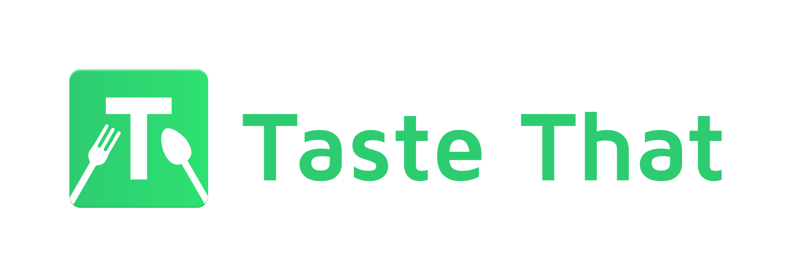

# Taste That

<h1 align=center>

</h1>

Android app developed with Android and Firebase Realtime Database and Firebase Cloud Functions

- Free APIs that have been used:
	- Qwant API ( https://www.qwant.com/ ) - used for displaying images of different foods and drinks.

- Libraries that have been used:
	- Android Support Library
	- RecyclerView ( https://developer.android.com/reference/android/support/v7/widget/RecyclerView.html )
	- Retrofit (by Square - http://square.github.io/retrofit/ ) - used for handling network requests.
	- Butter Knife (by Jake Wharton - http://jakewharton.github.io/butterknife/ ) - used for data binding.
	- Glide (by Bumptech - https://github.com/bumptech/glide ) - used for image loading.

- Database that has been used:
	- Firebase Realtime Database - NoSql database 
  
- Backend service that has been used:
  - Firebase cloud functions - this service gives the oportunity of writing simple JavaScript functions in order to compliment and ease development

- Functionalities:
	- Add combinations (by using the floating action button).
  - Sort content (by clicking on the 3-dot option in the top right corner).
  - Search for specific string (by using the magnifying glass in the top left corner).
  - View details about a combination (by clicking on the combination card).
  - Rate other peoples' combinations (by cicking on the "Rate" button on the combination card).
  - View the profile of the author of a combination (by clicking on the name in the combination details's screen).
  - View My (your) achivements (by clicking on the "Achievements" button in profile screen).
  - View My (your) uploaded combinations (by clicking on the "Uploads" button in profile screen).
  - View My (your) rated combinations (by clicking on the "Rated" button in profile screen).
  - Delete uploaded combination (by clicking on the 3-dot menu of a combination card in Uploads screen).
  - Enable offline data caching (by clicking on the switch in options screen).
